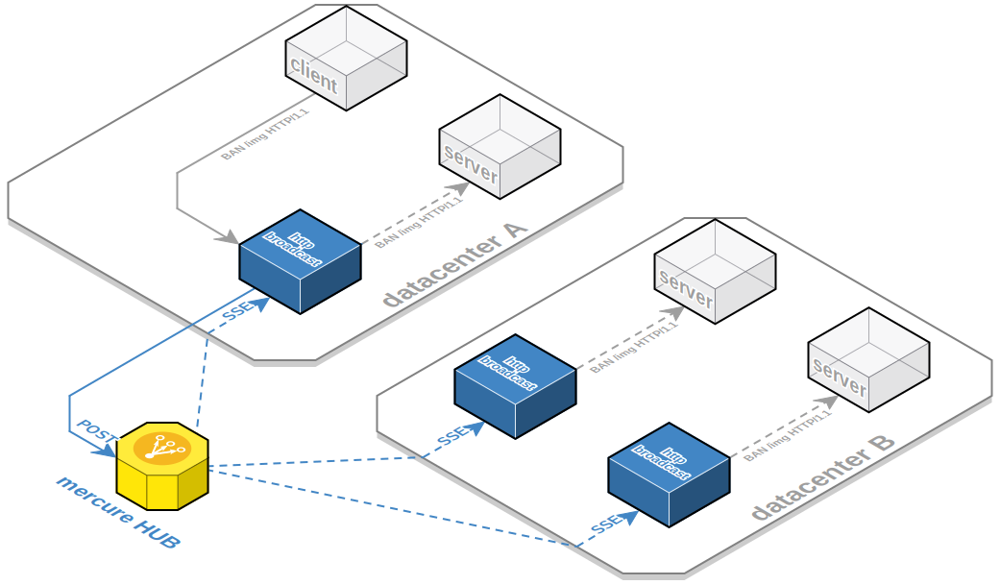

# HTTP Broadcast

A scalable and fault resilient HTTP Broadcaster built on top of [mercure](https://github.com/dunglas/mercure)
able to forward an HTTP request to several servers without the need to maintain a
registry.

This project has been initialized in order to invalidate a cluster of docker
varnish servers.

## Description

Each HTTP request sent to a listening http-broadcast is pushed into a 
[mercure HUB](https://github.com/dunglas/mercure), then dispatched to 
all listening http-broadcast who'll replay the same request.

## Use cases

Example of usage: Send PURGE/BAN requests to a cluster of Varnish containers.

The solution will be to embed a http-broadcast binary alongside each Varnish
instance (One could use the Inter-container network communication provided by
Kubernetes Pods). By sending a single request to one varnish container, the
http-broadcast will take care to dispatch the same request to all varnish
instances.

## Benefits

* No need to maintain an index: each server is allowed to start and die
  without to be registered somewhere
* Fault tolerant: if a server is temporary unreachable (network issue for
  instance), messages won't be lost: all missed messages will be re-played once
  recovered.
* Scalable: dealing with 1 or 2 000 servers is transparent for the client, it
  has a single request to perform.
* Network secured: Servers don't have to be exposed to the client which is
  complex to set up when the servers are located in different region of the
  world.
  
## Documentation

* [Getting started](docs/install.md).
* [Full documentation](docs/README.md).

## Contributing

See [CONTRIBUTING.md](CONTRIBUTING.md).
